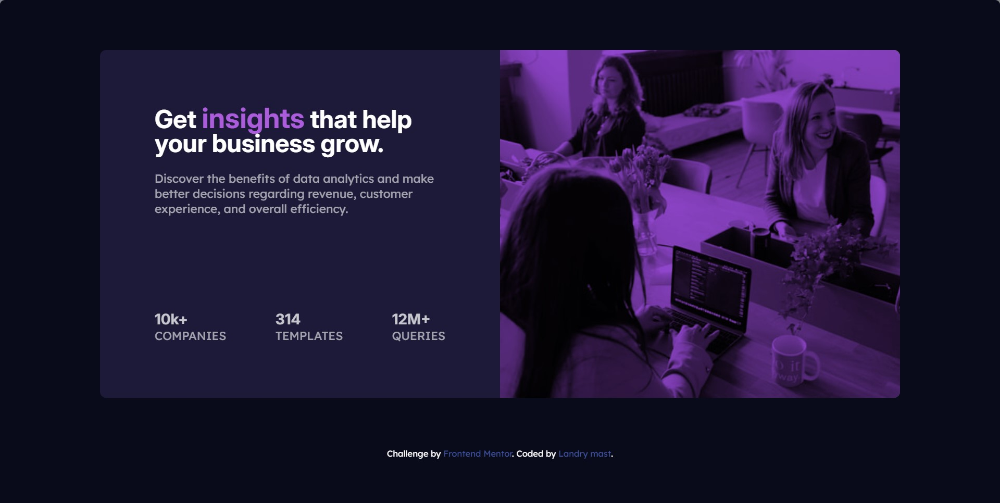

# Frontend Mentor - Stats preview card component solution

This is my solution to the [Stats preview card component challenge on Frontend Mentor](https://www.frontendmentor.io/challenges/stats-preview-card-component-8JqbgoU62). Frontend Mentor challenges help developers improve their frontend skills by building realistic projects from designs.

## Table of contents

- [Overview](#overview)
  - [The challenge](#the-challenge)
  - [Screenshot](#screenshot)
  - [Links](#links)
- [My process](#my-process)
  - [Built with](#built-with)
  - [What I learned](#what-i-learned)
  - [Continued development](#continued-development)
  - [Useful resources](#useful-resources)
  - [AI Collaboration](#ai-collaboration)
- [Author](#author)
- [Acknowledgments](#acknowledgments)

## Overview

### The challenge

Users should be able to:

- View the optimal layout depending on their device's screen size

The component contains a responsive stats preview card with a heading, a description, three business statistics, and a responsive image with a purple color overlay.

### Screenshot



### Links

- Solution URL: 
- Live Site URL: 

## My process

### Built with

- Semantic HTML5 markup
- CSS custom properties
- Flexbox
- Responsive design with CSS media queries
- The `picture` element for responsive images
- Google Fonts with Inter and Lexend Deca

### What I learned

This project helped me understand how to compare a design with an implementation and adjust the layout progressively instead of changing many properties at once.

I practiced using CSS custom properties for the design palette:

```css
:root {
  --Navy-950: hsl(233, 47%, 7%);
  --Blue-950: hsl(244, 37%, 16%);
  --Purple-500: hsl(277, 64%, 61%);
}
```

I also learned why `box-sizing: border-box` is useful when an element has a percentage width and padding. Without it, the padding is added to the declared width and can make the content extend beyond its parent.

For the responsive layout, the card changes from a row on desktop to a column on smaller screens:

```css
@media (max-width: 912px) {
  .card-component {
    flex-direction: column;
  }

  .right {
    order: -1;
  }
}
```

The image is selected with the `picture` element so the mobile and desktop designs can use different image assets:

```html
<picture>
  <source media="(max-width: 912px)" srcset="./assets/images/image-header-mobile.jpg">
  
</picture>
```

### Continued development

In future projects, I want to continue working on:

- Choosing responsive breakpoints from the content instead of relying only on device categories
- Improving typography and spacing through more precise design measurements
- Testing layouts at intermediate widths between the supplied desktop and mobile designs
- Publishing projects with a live site URL and a documented deployment workflow
- Improving accessibility with more detailed keyboard and screen-reader checks

### Useful resources

- [Frontend Mentor](https://www.frontendmentor.io/) - The challenge and design files provided the visual target for this project.
- [MDN: CSS Flexbox](https://developer.mozilla.org/en-US/docs/Web/CSS/CSS_flexible_box_layout) - This helped me understand the row and column layouts used by the card.
- [MDN: Responsive images](https://developer.mozilla.org/en-US/docs/Web/HTML/Guides/Responsive_images) - This helped me use the `picture` element for the desktop and mobile images.
- [MDN: CSS box-sizing](https://developer.mozilla.org/en-US/docs/Web/CSS/box-sizing) - This clarified how width and padding interact in the layout.
- [Google Fonts](https://fonts.google.com/) - Inter and Lexend Deca are the fonts specified by the style guide.

### AI Collaboration

I used GitHub Copilot as a learning and debugging assistant while building this project.

GitHub Copilot helped me by:

- Comparing the current HTML and CSS with the supplied desktop and mobile designs
- Identifying layout problems caused by incorrect widths, padding, and flex sizing
- Explaining why the `.left` section was not centered on tablet-sized screens
- Explaining why the image could disappear when the card changed from a row to a column
- Guiding the responsive layout with `flex-direction`, `order`, fixed image height, and media queries
- Explaining how to place a purple overlay over the image with a pseudo-element
- Reviewing the project structure and helping organize this README

The final implementation decisions and edits were made in the project while using these explanations to understand the underlying CSS concepts. The most useful part of the collaboration was working from a specific visual mismatch, forming a hypothesis about its cause, and checking the result at desktop and mobile widths.

## Author

- GitHub - [@nzanzulandry87-byte](https://github.com/nzanzulandry87-byte)
- Frontend Mentor - [nzanzulandry87-byte](https://www.frontendmentor.io/profile/nzanzulandry87-byte)

## Acknowledgments

- Thanks to [Frontend Mentor](https://www.frontendmentor.io/) for providing the challenge, design references, and starter assets.
- Thanks to GitHub Copilot for guiding the debugging and responsive design process while I implemented the project.
